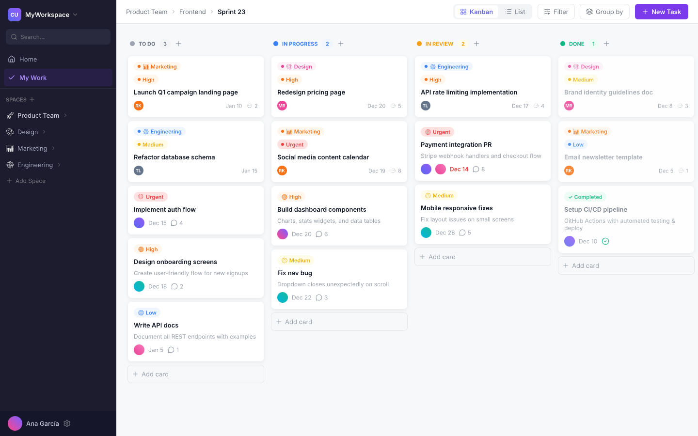
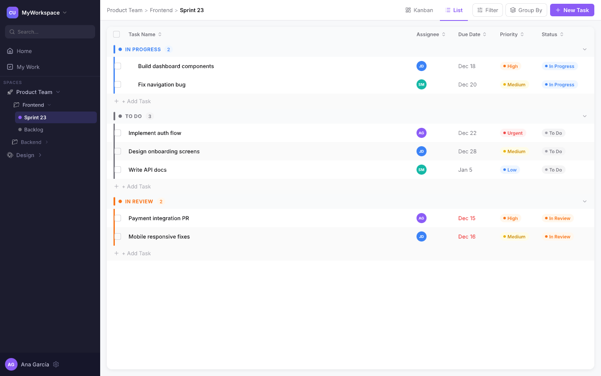
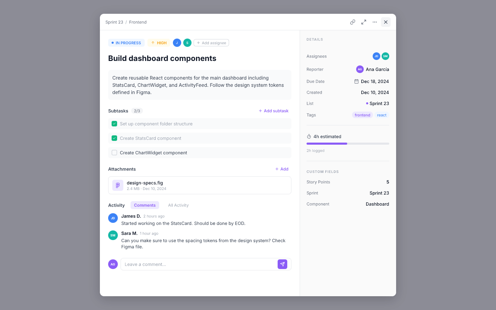

# ClickTasks - Task Manager for WordPress

A full-featured task management plugin for WordPress with Kanban boards, list views, and a modern single-page app interface.

## Screenshots

### Kanban Board


### List View


### Task Detail


## Features

- **Hierarchical organization** — Workspaces > Folders > Lists > Tasks
- **Kanban view** — Drag-and-drop columns organized by status
- **List view** — Sortable tabular view of tasks
- **Task properties** — Priority levels (Urgent, High, Normal, Low), custom statuses, due dates, tags, and multi-user assignment
- **Comments** — Discussion threads on each task
- **Filters** — Filter by status, priority, or assigned user
- **Responsive** — Mobile-friendly with adaptive sidebar
- **Internationalization** — i18n ready with Spanish translation included

## Requirements

- WordPress 6.0+
- PHP 8.0+

## Installation

1. Download or clone this repository into your `wp-content/plugins/` directory:
   ```bash
   cd wp-content/plugins/
   git clone https://github.com/ablancodev/clicktasks-wp-plugin.git
   ```
2. Activate the plugin from the WordPress admin panel.
3. Add the shortcode `[clicktasks]` to any page to render the app.

## Usage

Place the `[clicktasks]` shortcode on a page. Users with the appropriate capabilities will see the full task management interface.

### User capabilities

| Capability | Description |
|---|---|
| `ct_access_app` | Access the task manager |
| `ct_manage_workspaces` | Create and edit workspaces and folders |
| `ct_manage_tasks` | Create, edit, and delete tasks |

Administrators have all capabilities by default.

## Tech Stack

- **Backend:** PHP, WordPress custom post types & AJAX API
- **Frontend:** Vanilla JavaScript (ES modules), Tailwind CSS v4, SortableJS
- **Database:** WordPress native (post meta + comments)

## License

GPLv2 or later.

## Author

[ablancodev](https://ablancodev.com)
